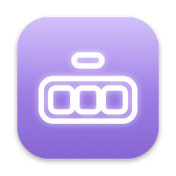
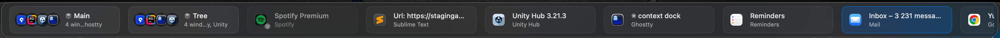

<p align="center">
  
</p>

<h1 align="center">ContextDock</h1>

<p align="center">
  A native macOS taskbar that shows <strong>one card per window</strong> and switches to
  <strong>exactly that window</strong>, not just the app.
</p>

<p align="center">
  
  
  
  
</p>

<p align="center">
  
</p>

## What it does

- **One card per window.** Every accessible top-level window (Unity Editor, Rider, Ghostty,
  anything else) gets a card with the app icon, a name you choose, and an optional badge and
  color. Three Unity windows are three cards, not one dock icon.
- **Groups.** Drag a card onto another to stack them. One click on the group brings all of
  its windows forward and focuses the one you used last.
- **Exact switching.** Clicking a card unhides, unminimizes and raises *that* window and
  verifies that it really became frontmost.
- **Remembered.** Names, badges, colors and groups survive relaunches, logouts and reboots.
- **Local only.** No accounts, no network, no telemetry, no private APIs. The only permission
  it needs is Accessibility.

## Quick start

```bash
git clone https://github.com/Yusuf-EROGLU/ContextDock.git
cd ContextDock
scripts/install-local.sh        # Release build → /Applications/ContextDock.app
open /Applications/ContextDock.app
```

Building needs Xcode 26.3 or newer; there is no prebuilt download yet. On first launch
ContextDock explains why it needs **Accessibility** access and offers *Request Access*. Enable
*ContextDock* in System Settings › Privacy & Security › Accessibility; the app re-checks on
its own (or use *Check Again*) and the bar appears at the bottom of the screen.

Without the permission the menu bar item and Settings still work and the bar shows the
permission state instead of windows. If the permission is removed later, discovery pauses
and the bar says so.

## Features

### Bar and handle

- Attaches to the **bottom, top, left or right** edge of the chosen display; left and right
  lay the cards out vertically.
- **Scrolls** along the bar when there are many cards: mouse wheel, trackpad, or drag an empty
  spot to pan. No visible scroll bar covers the cards.
- A small **handle capsule** on the bar shows the card count. Click it to collapse the bar to
  just the capsule; click again, or hover it for half a second, to expand.
- **Auto-hide** (on by default): the bar collapses by itself when the pointer stays away for
  5 s (1–30 s in Settings). Open menus, popups and drags pause the timer.

### Cards

- App icon, your name or the window title, a second line with the app or context, an optional
  badge and color. Hover, active window and drop target each have a distinct look; the full
  title is in the tooltip.
- Width 140–280 pt and height 40–84 pt are adjustable; below 50 pt the second line is hidden.
- *Details…* shows PID, process start time, AX role and subrole, the raw title and the
  session id, which helps when a window is filtered or matched unexpectedly.

### Groups

- Drop a card on the **middle** of another card to stack them; drop on an **edge** to reorder.
- A group card shows the member app icons and a name (yours, or one built from the member
  apps). Click the card to raise every member and focus the last-used one; click a single
  member icon to switch to that window only.
- Drag a member icon out of the group, or use *Remove from Group*, to detach it. A group with
  one member left dissolves on its own.

### Remembered across launches

- Names, badges, colors and groups are saved and re-attached after ContextDock or the Mac
  restarts. Windows have no durable identity, so the match is best effort and stops 15 minutes
  after launch: same process and title, then same app and title, then the only window of that
  app, then remaining windows of that app in order.
- A group breaks **only** when you ungroup it or one of its windows is closed while
  ContextDock is running. Sleep, screen lock, logout and shutdown are recognized and never
  count as closing.
- A wrongly re-attached card can simply be dragged out of its group or renamed.

### Search

- `Control + Option + Space` (changeable in Settings) or *Search Windows…* in the menu bar
  item. Type to filter by name, app, title or group; arrows move, Return switches (a group
  entry opens the whole group), Escape closes, `⌘1`–`⌘9` jump to the first nine results.

## Using the bar

| Action | Result |
|---|---|
| Left-click a card | Switch to that window. If the switch cannot be verified you get a short message in the bar, never a dialog. |
| Left-click a group | Raise every member, focus the one you used last. |
| Click a member icon on a group | Switch to that window only. |
| Right-click a card | *Rename…*, *Badge & Color…*, *Add to Group* / *Remove from Group*, *Reset Customization*, *Details…* |
| Right-click a group | *Open All Windows*, the member list, *Rename Group…*, *Badge & Color…*, *Ungroup* |
| Drag onto the middle of a card | Stack the two into a group. |
| Drag onto the edge of a card | Reorder. |
| Drag a member icon out of a group | Detach it from the group. |
| Click the handle | Collapse to the handle, or expand again. |
| `⌃⌥Space` | Open the search panel. |

**Menu bar item:** *Hide Bar* / *Show Bar*, *Collapse Bar to Handle* / *Expand Bar*,
*Refresh*, *Search Windows…*, the Accessibility status, *Settings…*, *Quit ContextDock*.

**Settings:**

| Section | Options |
|---|---|
| Bar | Show bar · Position (bottom, top, left, right) · Collapse to a handle when not in use, with delay · Edge margin · Screen (primary, display with active window, display under mouse) |
| Cards | Card width · Card height · Reset Size |
| Keyboard | Search shortcut recorder |
| Windows | Show auxiliary windows (dialogs, floating tool windows) |
| Advanced | Verbose debug logging · Reset all names, badges and groups… · location of the data folder |

## Optional integrations

- **Unity Editor bridge** ([`Integrations/Unity/`](Integrations/Unity/README.md)): a
  user-installed Editor script that reports the project name, so a Unity card shows which
  project it is without renaming it.
- **Ghostty labels** ([`Integrations/Ghostty/`](Integrations/Ghostty/README.md)): a zsh
  snippet with `contextdock_label "Backend"` that names a terminal through its window title.

Both are optional, documented in their own READMEs, and never installed automatically.

## Building from source

| Requirement | Value |
|---|---|
| macOS | 14.0 or later to run (developed and verified on macOS 26, Apple Silicon) |
| Xcode | 26.3 or newer (Swift 6.2+; verified with 26.3 and 27.0) |
| xcodegen | 2.46, optional; only needed after editing `project.yml` |
| Dependencies | None at runtime |

```bash
scripts/build.sh                  # Debug build into .build/DerivedData
scripts/build.sh Release
scripts/test.sh                   # automated tests (Swift Testing)
scripts/install-local.sh          # Release → /Applications/ContextDock.app
scripts/install-local.sh --user   # …or ~/Applications/ContextDock.app
```

The Xcode project is generated from `project.yml` and committed; `scripts/build.sh`
regenerates it when `project.yml` is newer and xcodegen is installed. The install script
refuses to replace a running ContextDock, removes an older copy in `~/Applications` when
installing system-wide, clears the quarantine flag on the installed copy and never touches
permissions. The app icon is rendered by `scripts/icon/render-icon.swift` into the asset
catalog.

<details>
<summary>Raw <code>xcodebuild</code> commands</summary>

```bash
xcodebuild -project ContextDock.xcodeproj -scheme ContextDock -configuration Debug \
  -derivedDataPath .build/DerivedData build
xcodebuild -project ContextDock.xcodeproj -scheme ContextDock -destination 'platform=macOS' \
  -derivedDataPath .build/DerivedData test
```

</details>

<details>
<summary>Signing and keeping the Accessibility grant across rebuilds</summary>

Without a signing identity the build is ad-hoc signed. macOS ties the Accessibility grant to
the signed code, so a *rebuilt* ad-hoc app loses the grant; remove and re-add ContextDock in
the Accessibility list (or run `tccutil reset Accessibility com.yusuferoglu.ContextDock`) to
grant it again.

For a stable grant, create a self-signed code-signing certificate named `ContextDock Dev`
(Keychain Access › Certificate Assistant › Create a Certificate, type *Code Signing*, or the
OpenSSL + `security import` route). The build scripts pick that identity up automatically;
`CODE_SIGN_IDENTITY` overrides it. Release builds use Hardened Runtime.

</details>

## Data, privacy and security

- Everything lives in `~/Library/Application Support/ContextDock/`:
  `state.json` (shortcut, names, badges, groups; versioned JSON written atomically, a corrupt
  file is kept as `state.json.corrupt-<timestamp>`, a file from a newer version is never
  overwritten), `diagnostics.log` (app names and counts only) and `Bridge/Unity/` for the
  optional Unity heartbeats. Simple preferences use `UserDefaults`.
- Only window titles and metadata are read: never window contents, terminal output or
  keystrokes. Logs hide titles and paths unless *Verbose debug logging* is on.
- No network, no telemetry, no subprocesses, no files outside its own support directory.
- Required permission: **Accessibility only**. No screen recording, full disk access,
  Automation, input monitoring or root.
- App Sandbox is off because the Accessibility API does not work from a sandboxed app; this
  does not bypass TCC, you still grant the permission explicitly. Release builds use Hardened
  Runtime.
- The global shortcut uses Carbon `RegisterEventHotKey`, which delivers only the registered
  combination. There is no key logging and no event tap.

## Troubleshooting

| Symptom | What to check |
|---|---|
| Bar shows "Accessibility permission required" although you granted it | The grant belongs to a previous build. Toggle ContextDock off and on in the Accessibility list, or set up the `ContextDock Dev` identity (see *Building from source*). |
| A window is missing | Dialogs and floating tool windows are hidden by default; enable *Show auxiliary windows*. Some apps do not expose windows on other Spaces. *Details…* shows the role and subrole. |
| Click activates the app but not the window | The app rejected the raise (modal sheet, unsupported attribute). ContextDock shows a message; try again once the dialog is closed. |
| App launches but shows no bar or menu item; `ps` shows an `AppTranslocation` path | The project files carried `com.apple.quarantine` (AirDrop, Downloads) and the build inherited it. Run `xattr -dr com.apple.quarantine .` in the repo once and reinstall; the install script clears the flag on the installed app. |
| A drag does not start | Move at least 5 pt before releasing; a short press is a click. Drop on the middle of a card to group, on its edge to reorder. |
| Shortcut does nothing | macOS cannot tell ContextDock when another app already owns the combination. Pick another one in Settings; *Search Windows…* in the menu always works. |
| Names or groups did not come back after relaunch | Re-attaching is best effort within 15 minutes of launch (see *Remembered across launches*). A window that opened later, or an app with several look-alike windows, may not be matched; rename or regroup it once and it is remembered again. |

`KNOWN_LIMITATIONS.md` lists what the app cannot do and why; `TEST_REPORT.md` records what
has been verified on real machines.

## Uninstall

Quit ContextDock and delete `/Applications/ContextDock.app` (or
`~/Applications/ContextDock.app`). Optionally delete
`~/Library/Application Support/ContextDock/` and remove ContextDock from the Accessibility
list. Remove the Unity or Ghostty integration files if you installed them.

## License

MIT. See [`LICENSE`](LICENSE).
